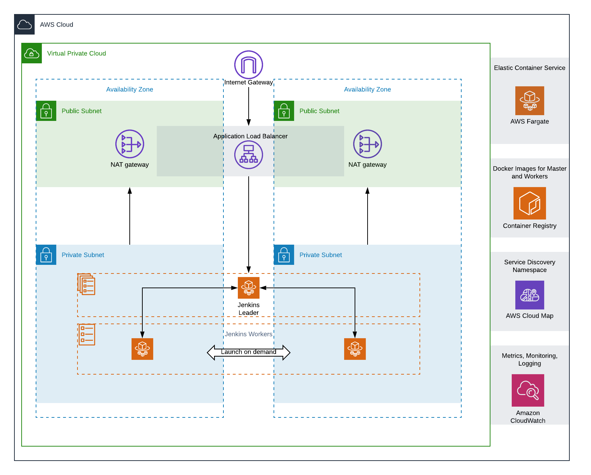

# Jenkins on AWS

## What is this?
This project will build and deploy an immutable, fault tolerant, and cost effective Jenkins environment in AWS using ECS. All Jenkins images are managed within the repository (pulled from upstream) and fully configurable as code. Plugin installation is automated, including versioning, as well as configured through the Configuration as Code [plugin](https://jenkins.io/projects/jcasc/).

## Why
Managing Jenkins is hard. From plugin management and configuration details, to ensuring that the nodes are up to date and running, it's a lot of work and susceptible to issues. With this platform, you inherit the [Well Architected](https://aws.amazon.com/architecture/well-architected/) best practices. 

## Architecture



## Project Structure

```
./

./cdk/ <-- Deployment configuration

./cdk/docker/ <-- Dockerfiles and associated config files for Master and Worker images

./cdk/app.py <-- cdk application file where all stacks are instantiated and built

./cdk/requirements.txt <-- Python module requirements

./cdk/jenkins/ <-- cdk stacks to deploy Jenkins environment
```


## Requirements

To deploy this environment, we will use the [aws-cdk](https://github.com/aws/aws-cdk)
- Please follow the requirements to install from the cdk github repo
- Tested with the following version: `1.15.0 (build bdbe3aa)`

## Fargate Jenkins (Master and Workers)

Set config.ini
```bash
fargate_enabled = yes
```

## EC2 Backed Master and Fargate Workers
Set config.ini
```bash
ec2_enabled = yes
```

## Validate configs and deploy

Navigate to the cdk directory, and run:

```bash 
cdk synth
```

Output should look something like:

```console
[user@computer cdk (cdk)]$ cdk synth
Successfully synthesized to jenkins-on-aws/cdk/cdk.out
Supply a stack name (JenkinsOnAWSNetwork, JenkinsOnAWSECS, JenkinsOnAWSWorker, JenkinsOnAWSJenkinsMaster) to display its template.
```

Feel free to check out the [CloudFormation](https://aws.amazon.com/cloudformation/) templates created by the cdk in the `cdk.out` directory

Let's deploy the environment! The below command will deploy all of the stacks required to get the environment up and running:

```bash
cdk deploy Jenkins*
```

_Note:_ You will be prompted for approval during the stages of the deploy. Follow the instructions on the prompt when asked.


That's it! You now have a fully automated Jenkins implementation running on AWS Fargate with worker nodes automatically configured to run on an as needed basis.


